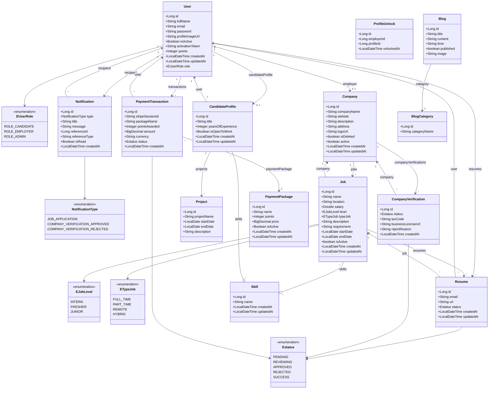

```mermaid
classDiagram
    direction TB

    class EUserRole {
        <<enumeration>>
        ROLE_CANDIDATE
        ROLE_EMPLOYER
        ROLE_ADMIN
    }

    class Estatus {
        <<enumeration>>
        PENDING
        REVIEWING
        APPROVED
        REJECTED
        SUCCESS
    }

    class EJobLevel {
        <<enumeration>>
        INTERN
        FRESHER
        JUNIOR
    }

    class ETypeJob {
        <<enumeration>>
        FULL_TIME
        PART_TIME
        REMOTE
        HYBRID
    }

    class NotificationType {
        <<enumeration>>
        JOB_APPLICATION
        COMPANY_VERIFICATION_APPROVED
        COMPANY_VERIFICATION_REJECTED
    }

    class User {
        +Long id
        +String fullName
        +String email
        +String password
        +String profileImageUrl
        +Boolean isActive
        +String activationToken
        +Integer points
        +LocalDateTime createdAt
        +LocalDateTime updatedAt
        +EUserRole role
    }

    class Company {
        +Long id
        +String companyName
        +String website
        +String description
        +String address
        +String logoUrl
        +boolean isDeleted
        +boolean active
        +LocalDateTime createdAt
        +LocalDateTime updatedAt
    }

    class Job {
        +Long id
        +String name
        +String location
        +Double salary
        +EJobLevel level
        +ETypeJob typeJob
        +String description
        +String requirement
        +LocalDate startDate
        +LocalDate endDate
        +boolean isActive
        +LocalDateTime createdAt
        +LocalDateTime updatedAt
    }

    class Resume {
        +Long id
        +String email
        +String url
        +Estatus status
        +LocalDateTime createdAt
        +LocalDateTime updatedAt
    }

    class Skill {
        +Long id
        +String name
        +LocalDateTime createdAt
        +LocalDateTime updatedAt
    }

    class CandidateProfile {
        +Long id
        +String title
        +Integer yearsOfExperience
        +Boolean isOpenToWork
        +LocalDateTime createdAt
        +LocalDateTime updatedAt
    }

    class Project {
        +Long id
        +String projectName
        +LocalDate startDate
        +LocalDate endDate
        +String description
    }

    class CompanyVerification {
        +Long id
        +Estatus status
        +String taxCode
        +String businessLicenseUrl
        +String rejectReason
        +LocalDateTime createdAt
    }

    class Notification {
        +Long id
        +NotificationType type
        +String title
        +String message
        +Long referenceId
        +String referenceType
        +Boolean isRead
        +LocalDateTime createdAt
    }

    class PaymentPackage {
        +Long id
        +String name
        +Integer points
        +BigDecimal price
        +Boolean isActive
        +LocalDateTime createdAt
        +LocalDateTime updatedAt
    }

    class PaymentTransaction {
        +Long id
        +String stripeSessionId
        +String packageName
        +Integer pointsAwarded
        +BigDecimal amount
        +String currency
        +Estatus status
        +LocalDateTime createdAt
    }

    class ProfileUnlock {
        +Long id
        +Long employerId
        +Long profileId
        +LocalDateTime unlockedAt
    }

    class Blog {
        +Long id
        +String title
        +String content
        +String time
        +boolean published
        +String image
    }

    class BlogCategory {
        +Long id
        +String categoryName
    }

    User "1" --> "0..1" Company : employer
    User "1" --> "0..1" CandidateProfile : candidateProfile
    User "1" --> "*" Resume : resumes
    User "1" --> "*" PaymentTransaction : transactions
    User "1" --> "*" Notification : recipient

    Company "1" --> "*" Job : jobs
    Company "1" --> "*" CompanyVerification : companyVerifications

    Job "*" --> "1" Company : company
    Job "1" --> "*" Resume : resumes
    Job "*" --o "*" Skill : skills

    Resume "*" --> "1" User : user
    Resume "*" --> "1" Job : job

    CandidateProfile "1" --> "1" User : user
    CandidateProfile "1" --> "*" Project : projects
    CandidateProfile "*" --o "*" Skill : skills

    CompanyVerification "*" --> "1" Company : company

    Notification "*" --> "1" User : recipient

    PaymentTransaction "*" --> "1" User : user
    PaymentTransaction "*" --> "1" PaymentPackage : paymentPackage

    Blog "*" --> "1" BlogCategory : category

    User --> EUserRole
    Job --> EJobLevel
    Job --> ETypeJob
    Resume --> Estatus
    CompanyVerification --> Estatus
    PaymentTransaction --> Estatus
    Notification --> NotificationType
```