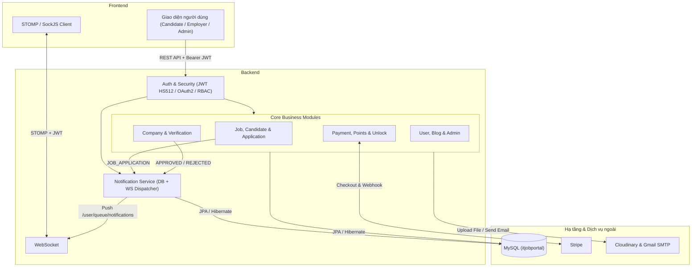

# Component Diagram — IT Job Portal

Sơ đồ thành phần (Component Diagram) của project:

```mermaid
flowchart TB
    subgraph FE["Frontend"]
        UI["Giao diện người dùng (Candidate / Employer / Admin)"]
        WSClient["STOMP / SockJS Client"]
    end

    subgraph BE["Backend"]
        direction TB
        Auth["Auth & Security (JWT HS512 / OAuth2 / RBAC)"]
        WS["WebSocket"]

        subgraph Modules["Core Business Modules"]
            direction LR
            JobApp["Job, Candidate & Application"]
            CompanyVerify["Company & Verification"]
            Payment["Payment, Points & Unlock"]
            UserBlog["User, Blog & Admin"]
        end

        Notif["Notification Service (DB + WS Dispatcher)"]
    end

    subgraph EXT["Hạ tầng & Dịch vụ ngoài"]
        direction LR
        DB[("MySQL (itjobportal)")]
        Stripe["Stripe"]
        CloudMail["Cloudinary & Gmail SMTP"]
    end

    %% ─── Frontend <-> Backend ───
    UI -->|"REST API + Bearer JWT"| Auth
    WSClient <-->|"STOMP + JWT"| WS

    %% ─── Internal Routing ───
    Auth --> Modules
    Auth --> Notif

    %% ─── Notification Flows ───
    JobApp -->|"JOB_APPLICATION"| Notif
    CompanyVerify -->|"APPROVED / REJECTED"| Notif
    Notif -->|"Push /user/queue/notifications"| WS

    %% ─── Data & External Services ───
    Modules -->|"JPA / Hibernate"| DB
    Notif -->|"JPA / Hibernate"| DB
    Payment <-->|"Checkout & Webhook"| Stripe
    Modules -->|"Upload File / Send Email"| CloudMail
```
